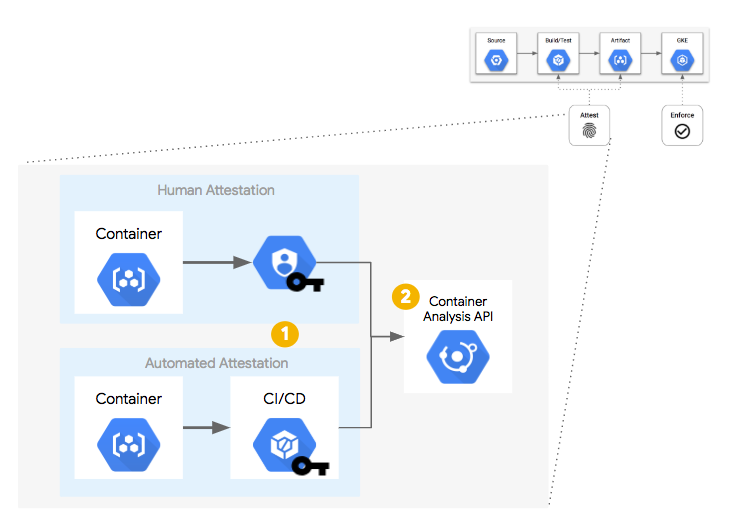
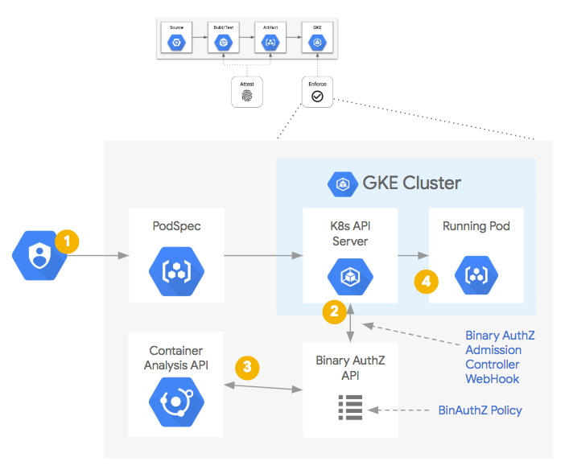
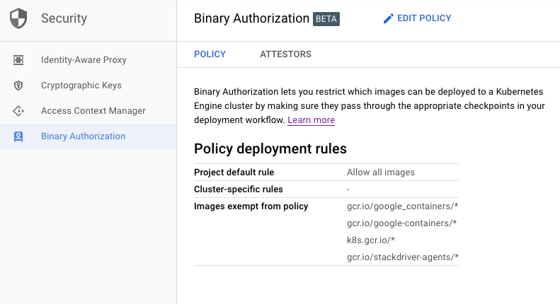
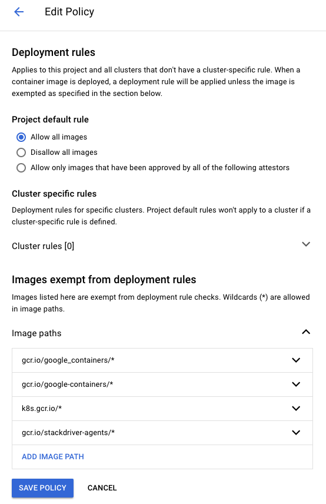
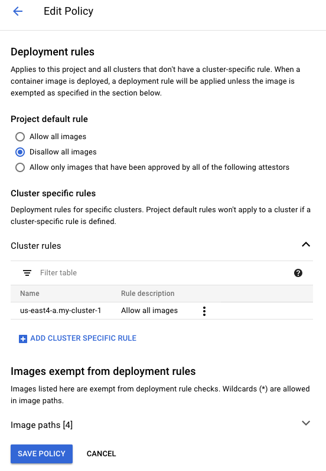
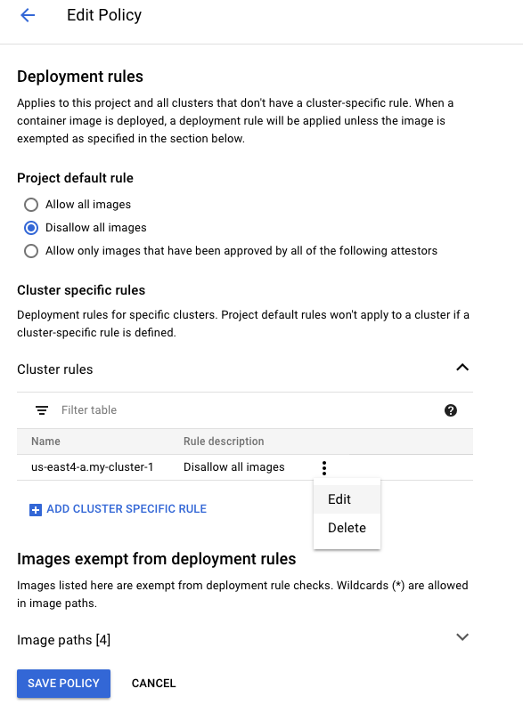
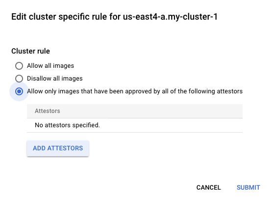

# Google Kubernetes Engine Binary Authorization Demo

## Table of Contents

<!--ts-->

* [Google Kubernetes Engine Binary Authorization Demo](#google-kubernetes-engine-binary-authorization-demo)
* [Introduction](#introduction)
* [Architecture](#architecture)
* [Prerequisites](#prerequisites)
  * [Run Demo in a Google Cloud Shell](#run-demo-in-a-google-cloud-shell)
  * [Supported Operating Systems](#supported-operating-systems)
  * [Tools](#tools)
  * [Versions](#versions)
* [Deployment Steps](#deployment-steps)
* [Validation](#validation)
* [Tear Down](#tear-down)
* [Troubleshooting](#troubleshooting)
* [Relevant Materials](#relevant-materials)

<!--te-->

## Introduction

One of the key security concerns for running Kubernetes clusters is knowing what container images are running inside each pod and being able to account for their origin.  Establishing "container provenance" means having the ability to trace the source of a container to a trusted point of origin and ensuring your organization follows the desired processes during artifact (container) creation.

Some of the key concerns are:

* Safe Origin - How do you ensure that all container images running in the cluster come from an approved source?
* Consistency and Validation - How do you ensure that all desired validation steps were completed successfully for every container build and every deployment?
* Integrity - How do you ensure that containers were not modified before running after their provenance was proven?

From a security standpoint, not enforcing where images originate from presents several risks:

* A malicious actor that has compromised a container may be able to obtain sufficient cluster privileges to launch other containers from an unknown source without enforcement.
* An authorized user with the permissions to create pods may be able to accidentally or maliciously run an undesired container directly inside a cluster.
* An authorized user may accidentally or maliciously overwrite a docker image tag with a functional container that has undesired code silently added to it, and Kubernetes will pull and deploy that container as a part of a deployment automatically.

To help system operators address these concerns, Google Cloud Platform offers a capability called [Binary Authorization][4]. Binary Authorization is a GCP managed service that works closely with GKE to enforce deploy-time security controls to ensure that only trusted container images are deployed. With Binary Authorization you can whitelist container registries, require images to have been signed by trusted authorities, and centrally enforce those policies. By enforcing this policy, you can gain tighter control over your container environment by ensuring only approved and/or verified images are integrated into the build-and-release process.

This proof of concept deploys a [Kubernetes Engine](https://cloud.google.com/kubernetes-engine/) Cluster with the Binary Authorization feature enabled, demonstrates how to whitelist approved container registries, and walks you through the process of creating and running a signed container.

## Architecture

The Binary Authorization and Container Analysis APIs are based upon the open source projects [Grafeas][5] and [Kritis][6].

* [Grafeas][5] defines an API spec for managing metadata about software resources, such as container images, Virtual Machine (VM) images, JAR files, and scripts. You can use Grafeas to define and aggregate information about your project’s components.
* [Kritis][6] defines an API for ensuring a deployment is prevented unless the artifact (container image) is conformant to central policy and optionally has the necessary attestations present.

In a simplified container deployment pipeline such as this:


The container goes through at least 4 steps:

1. The source code for creating the container is stored in source control.
1. Upon committing a change to source control, the container is built and tested.
1. If the build and test steps are completed, the container image artifact is then placed in a central container registry, ready for deployment.
1. When a deployment of that container version is submitted to the Kubernetes API, the container runtime will pull that container image from the container registry and run it as a pod.

In a container build pipeline, there are opportunities to inject additional processes to signify or "attest" that each step was completed successfully. Examples include running unit tests, source control analysis checks, licensing verification, vulnerability analysis, and more.  Each step could be given the power or "attestation authority" to sign for that step being completed.  An "attestation authority" is a human or system with the correct PGP key and the ability to register that "attestation" with the Container Analysis API.

By using separate PGP keys for each step, each attestation step could be performed by different humans, systems, or build steps in the pipeline (1).  Each PGP key is associated with an "attestation note" which is stored in the Container Analysis API.  When a build step "signs" an image, a snippet of JSON metadata about that image is signed via PGP and that signed snippet is submitted to the API as a "note occurrence" (2).



Once the container image has been built and the necessary attestations have been stored centrally, they are available for being queried as a part of a policy decision process.  In this case, a [Kubernetes Admission Controller][8], upon receiving an API request to `create` or `update` a `Pod`:

1. Will send a WebHook to the Binary Authorization API for a policy decision.
1. The Binary Authorization policy is then consulted.
1. If necessary, the Container Analysis API is also queried for the necessary attestation occurrences.
1. If the container image conforms to the policy, it is allowed to run.  If the container image fails to meet the policy, an error is presented to the API client with a message describing why it was prevented.



## Prerequisites

* Access to an existing Google Cloud project with the Kubernetes Engine service enabled. If you do not have a Google Cloud account, please signup for a free trial [here][2].
* A Google Cloud account and project is required for this demo. The project must have the proper quota to run a Kubernetes Engine cluster with at least 2 vCPUs and 7.5GB of RAM. How to check your account's quota is documented here: [quotas][1].

### Supported Operating Systems

This demo can be run from MacOS, Linux, or, alternatively, directly from [Google Cloud Shell](https://cloud.google.com/shell/docs/). The latter option is the simplest as it only requires browser access to GCP and no additional software is required. Instructions for both alternatives can be found below.

### Deploying Demo from Google Cloud Shell

_NOTE: This section can be skipped if the cloud deployment is being performed without Cloud Shell, for instance from a local machine or from a server outside GCP._

[Google Cloud Shell](https://cloud.google.com/shell/docs/) is a browser-based terminal that Google provides to interact with your GCP resources. It is backed by a free Compute Engine instance that comes with many useful tools already installed, including everything required to run this demo.

Click the button below to open the demo in your Cloud Shell:

[](https://console.cloud.google.com/cloudshell/open?git_repo=https%3A%2F%2Fgithub.com%2FGoogleCloudPlatform%2Fgke-binary-auth-demo&page=editor&tutorial=README.md)

To prepare [gcloud](https://cloud.google.com/sdk/gcloud/) for use in Cloud Shell, execute the following command in the terminal at the bottom of the browser window you just opened:

```console
gcloud init
```

Respond to the prompts and continue with the following deployment instructions. The prompts will include the account you want to run as, the current project, and, optionally, the default region and zone. These configure Cloud Shell itself-the actual project, region, and zone, used by the demo will be configured separately below.

Run the following commands to install the random number generator tools.  This will allow your Cloud Shell to have the entropy needed to create the PGP key in a later step:

```console
sudo apt-get install rng-tools
sudo rngd -r /dev/urandom
```

### Deploying the Demo without Cloud Shell

_NOTE: If the demo is being deployed via Cloud Shell, as described above, this section can be skipped._

For deployments without using Cloud Shell, you will need to have access to a computer providing a [bash](https://www.gnu.org/software/bash/) shell with the following tools installed:

* [Google Cloud SDK (v214.0.0 or later)](https://cloud.google.com/sdk/downloads) with the `beta` components installed
* [kubectl (v1.10.0 or later)](https://kubernetes.io/docs/tasks/tools/install-kubectl/)
* [git](https://git-scm.com/)
* [docker](https://www.docker.com)
* [GnuPG](https://www.gnupg.org/)

Use `git` to clone this project to your local machine:

```console
git clone https://github.com/GoogleCloudPlatform/gke-binary-auth-demo
```

When downloading is complete, change your current working directory to the new project:

```console
cd gke-binary-auth-demo
```

Continue with the instructions below, running all commands from this directory.

## Deployment Steps

_NOTE: The following instructions are applicable for deployments performed both with and without Cloud Shell._

To deploy the cluster, execute the following command:

```console
./create.sh -c my-cluster-1
```

Replace the text `my-cluster-1` the name of the cluster that you would like to create.

The create script will output the following message when complete:

```console
NAME          LOCATION    MASTER_VERSION  MASTER_IP     MACHINE_TYPE   NODE_VERSION  NUM_NODES  STATUS
my-cluster-1  us-east4-a  1.10.7-gke.1    35.199.5.183  custom-1-6656  1.10.7-gke.1  2          RUNNING
Fetching cluster endpoint and auth data.
kubeconfig entry generated for my-cluster-1.
```

The script will:

1. Enable the necessary APIs in your project.  Specifically, `container`, `containerregistry`, `containeranalysis`, and `binaryauthorization`.
1. Create a new Kubernetes Engine cluster in your default ZONE, VPC and network.
1. Retrieve your cluster credentials to enable `kubectl` usage.

## Validation

The following script will validate that the demo is deployed correctly:

```console
./validate.sh -c my-cluster-1
```

Replace the text `my-cluster-1` the name of the cluster that you would like to validate. If the script fails it will output:

```console
Validation Failed: the BinAuthZ policy was NOT available
```

And / Or

```console
Validation Failed: the Container Analysis API was NOT available
```

If the script passes if will output:

```console
Validation Passed: the BinAuthZ policy was available
Validation Passed: the Container Analysis API was available
```

### Using Binary Authorization

#### Managing the Binary Authorization Policy

To access the Binary Authorization Policy configuration UI, perform the following steps:

* In the GCP console navigate to the **Security** -> **Binary Authorization** page.
* You will see the following interface.  Click **Edit Policy** and then **Save Changes** to make and save changes.



To access the Binary Authorization Policy configuration via `gcloud`:

* Run `gcloud beta container binauthz policy export > policy.yaml`
* Make the necessary edits to `policy.yaml`
* Run `gcloud beta container binauthz policy import policy.yaml`

The policy you are editing is the "default" policy, and it applies to *all GKE clusters in the GCP project* unless a cluster-specific policy is in place.  The recommendation is to create policies specific to each cluster and achieve successful operation (whitelisting registries as needed), and then set the default project-level policy to "Deny All Images".  Any new cluster in this project will then need its own cluster-specific policy.

Upon clicking **Edit Policy**, the following will appear:



The default policy rule is to `Allow all images`.  This mimics the behavior as if Binary Authorization wasn't enabled on the cluster.  If the default rule is changed to `Disallow all images` or `Allow only images that have been approved by all of the following attestors`, then images that do not match the exempted registry image paths or do not have the required attestations will be blocked, respectively.

For the next steps, change your default rule to `Disallow all images` and then expand and add your cluster to the Cluster Specific rules section.  Note that the form is expecting `location.clustername`.  e.g. `us-east4-a.my-cluster-1` which corresponds to the zone `us-east4-a` and the cluster name `my-cluster-1`. The zone and cluster name are available by looking at the output of `gcloud container clusters list`. Select the default rule of `Allow all images` for your cluster.  When you see something like the following, click **Save Policy**.



#### Creating a Private GCR Image

To simulate a real-world configuration, we need to create a private GCR container image in our project.  We'll pull down the `nginx` container from `gcr.io/google-containers/nginx` project and push it to our own GCR repoistory without modification.

Pull down the `latest` `nginx` container:

```console
docker pull gcr.io/google-containers/nginx:latest
```

Authenticate docker to the project:

```console
gcloud auth configure-docker
```

Set our `PROJECT_ID` shell variable:

```console
PROJECT_ID="$(gcloud config get-value project)" # Or replace with your current project ID
```

Tag and push it to the current project's GCR:

```console
docker tag gcr.io/google-containers/nginx "gcr.io/${PROJECT_ID}/nginx:latest"
docker push "gcr.io/${PROJECT_ID}/nginx:latest"
```

List the "private" nginx image in our own GCR repository:

```console
gcloud container images list-tags "gcr.io/${PROJECT_ID}/nginx"
```

#### Denying All Images

To prove that image denial by policy will eventually work as intended, we need to first verify that the cluster-specific allow rule is in place and allows all containers to run. To do this, launch a single `nginx` pod:

```console
cat << EOF | kubectl create -f -
apiVersion: v1
kind: Pod
metadata:
  name: nginx
spec:
  containers:
  - name: nginx
    image: "gcr.io/${PROJECT_ID}/nginx:latest"
    ports:
    - containerPort: 80
EOF
```

You should see a message stating that `pod "nginx" created` and the following after listing the pods:

```console
kubectl get pods
NAME    READY     STATUS    RESTARTS   AGE
nginx   1/1       Running   0          1m
```

If not, recheck your cluster-specific region and name and try again. Now, delete this pod:

```console
kubectl delete pod nginx
```

Next, let's prove that the Binary Authorization policy can block undesired images from running in our cluster. Under the Binary Authorization UI page, click **Edit Policy**, expand the `Cluster Rules` dropdown, click on the three vertical dots to the right of your Cluster rule, and click `edit`.  Then, select `Disallow all images`, click **Submit**.

Your policy should look similar to the following:


Finally, click **Save Policy** to apply those changes.

Wait at least 30 seconds before proceeding to allow the policy to take effect. Now, run the same command from above to create the static `nginx` pod:

```console
cat << EOF | kubectl create -f -
apiVersion: v1
kind: Pod
metadata:
  name: nginx
spec:
  containers:
  - name: nginx
    image: "gcr.io/${PROJECT_ID}/nginx:latest"
    ports:
    - containerPort: 80
EOF
```

This time, though, you should receive a message from the API server indicating that the policy prevented this pod from being successfully run:

```console
Error from server (Forbidden): error when creating "STDIN": pods "nginx" is forbidden: image policy webhook backend denied one or more images: Denied by cluster admission rule for us-east4-a.my-cluster-1. Overridden by evaluation mode
```

To be able to see when any and all images are blocked by the Binary Authorization Policy, navigate to the GKE Audit Logs in Stackdriver and filter on those error messages related to this activity.

1. In the GCP console navigate to the **Stackdriver** -> **Logging** page
1. On this page, click the downward arrow on the far right of the "Filter by label or text search" input field, and select `Convert to advanced filter`.  Populate the text box with `resource.type="k8s_cluster" protoPayload.status.message="PERMISSION_DENIED"`
1. You should see errors corresponding to the blocking of the `nginx` pod from running.

#### Denying Images Except From Whitelisted Container Registries

Let's say that we actually want to allow *just* that nginx container to run.  The quickest step to enable this is to *whitelist* the registry that it comes from.  To do this, edit the Binary Authorization Policy and add a new image path entry.  The image below shows an example path, but you will want to use the output of the following command as your image path instead:

```console
echo "gcr.io/${PROJECT_ID}/nginx*"
```


Save the policy and now run:

```console
cat << EOF | kubectl create -f -
apiVersion: v1
kind: Pod
metadata:
  name: nginx
spec:
  containers:
  - name: nginx
    image: "gcr.io/${PROJECT_ID}/nginx:latest"
    ports:
    - containerPort: 80
EOF
```

You should now be able to launch this pod and prove that registry whitelisting is working correctly.

Run the following to clean up and prepare for the next steps:

```console
kubectl delete pod nginx
```

#### Enforcing Attestations

Whitelisting container image registries is a great first step in preventing undesired container images from being run inside a cluster, but there is more we can do to ensure the container was built correctly. We want to cryptographically verify that a given container image was approved for deployment.  This is done by an "attestation authority" which states or *attests* to the fact that a certain step was completed.  The attestation authority does this by using a PGP key to *sign* a snippet of metadata describing the SHA256 hash of a container image and submitting it to a central metadata repository--the Container Analysis API.

Later, when the Admission Controller goes to validate if a container image is allowed to run by consulting a Binary Authorization policy that requires attestations to be present on an image, it will check to see if the Container Analysis API holds the signed snippet(s) of metadata saying which steps were completed.  With that information, the Admission Controller will know whether to allow or deny that pod from running.

In this next example, you'll perform a manual attestation of a container image.  That is, you will take on the role of a human attestation authority and will perform all the steps to sign a container image, create a policy to require that attestation to be present on images running inside your cluster, and then successfully run that image in a pod.

##### Setting up the Necessary Variables

Project settings:

```console
# Current project ID
PROJECT_ID="$(gcloud config get-value project)" # Or replace with your current project ID
```

Attestor name/email details:

```console
ATTESTOR="manually-verified" # No spaces allowed
ATTESTOR_NAME="Manual Attestor"
ATTESTOR_EMAIL="$(gcloud config get-value core/account)" # This uses your current user/email
```

Container Analysis Note ID/description of our attestation authority:

```console
NOTE_ID="Human-Attestor-Note" # No spaces
NOTE_DESC="Human Attestation Note Demo"
```

Names for files to create payloads/requests:

```console
NOTE_PAYLOAD_PATH="note_payload.json"
IAM_REQUEST_JSON="iam_request.json"
```

##### Creating an Attestation Note

The first step is to register the attestation authority as a [Container Analysis note][7] with the Container Analysis API.  To do this, you'll create an `ATTESTATION` note and submit it to the API.

Create the `ATTESTATION` note payload:

```console
cat > ${NOTE_PAYLOAD_PATH} << EOF
{
  "name": "projects/${PROJECT_ID}/notes/${NOTE_ID}",
  "attestation": {
    "hint": {
      "human_readable_name": "${NOTE_DESC}"
    }
  }
}
EOF
```

Submit the `ATTESTATION` note to the Container Analysis API:

```console
curl -X POST \
    -H "Content-Type: application/json" \
    -H "Authorization: Bearer $(gcloud auth print-access-token)"  \
    --data-binary @${NOTE_PAYLOAD_PATH}  \
    "https://containeranalysis.googleapis.com/v1/projects/${PROJECT_ID}/notes/?noteId=${NOTE_ID}"
```

You should see the output from the prior command display the created note, but the following command will also list the created note:

```console
curl -H "Authorization: Bearer $(gcloud auth print-access-token)"  \
    "https://containeranalysis.googleapis.com/v1/projects/${PROJECT_ID}/notes/${NOTE_ID}"
```

##### Creating a PGP Signing Key

As our attestation authority uses a PGP key to peform the cryptographic signing of the image metadata, we need to create a new PGP key and export the public PGP key.  Note: This PGP key is not password protected for this exercise.  In a production system, be sure to properly safeguard your private PGP keys.

Set another shell variable:

```console
PGP_PUB_KEY="generated-key.pgp"
```

Create the PGP key (Use an empty passphrase and acknowledge warnings):

```console
gpg --quick-generate-key --yes ${ATTESTOR_EMAIL}
```

Extract the public PGP key:

```console
gpg --armor --export "${ATTESTOR_EMAIL}" > ${PGP_PUB_KEY}
```

##### Registering the Attestor in the Binary Authorization API

The next step is to create the "attestor" in the Binary Authorization API and add the public PGP key to it.

Create the Attestor in the Binary Authorization API:

```console
gcloud --project="${PROJECT_ID}" \
    beta container binauthz attestors create "${ATTESTOR}" \
    --attestation-authority-note="${NOTE_ID}" \
    --attestation-authority-note-project="${PROJECT_ID}"
```

Add the PGP Key to the Attestor:

```console
gcloud --project="${PROJECT_ID}" \
    beta container binauthz attestors public-keys add \
    --attestor="${ATTESTOR}" \
    --public-key-file="${PGP_PUB_KEY}"
```

List the newly created Attestor:

```console
gcloud --project="${PROJECT_ID}" \
    beta container binauthz attestors list
```

The output should look similar to the following:

```console
┌───────────────────┬────────────────────────────────────────────────────────────┬─────────────────┐
│        NAME       │                            NOTE                            │ NUM_PUBLIC_KEYS │
├───────────────────┼────────────────────────────────────────────────────────────┼─────────────────┤
│ manually-verified │ projects/<myprojectnamehere>/notes/Human-Attestor-Note     │ 1               │
└───────────────────┴────────────────────────────────────────────────────────────┴─────────────────┘
```

##### "Signing" a Container Image

The preceeding steps only need to be performed once.  From this point on, this step is the only step that needs repeating for every new container image.

The `nginx` image at `gcr.io/google-containers/nginx:latest` is already built and available for use, so we'll perform the manual attestations on it as if it were our own image built by our own processes and save the step of having to build it.

Set a few shell variables:

```console
GENERATED_PAYLOAD="generated_payload.json"
GENERATED_SIGNATURE="generated_signature.pgp"
```

Get the PGP fingerprint:

```console
PGP_FINGERPRINT="$(gpg --list-keys ${ATTESTOR_EMAIL} | head -2 | tail -1 | awk '{print $1}')"
```

Obtain the SHA256 Digest of the container image:

```console
IMAGE_PATH="gcr.io/${PROJECT_ID}/nginx"
IMAGE_DIGEST="$(gcloud container images list-tags --format='get(digest)' $IMAGE_PATH | head -1)"
```

Create a JSON-formatted signature payload:

```console
gcloud beta container binauthz create-signature-payload \
    --artifact-url="${IMAGE_PATH}@${IMAGE_DIGEST}" > ${GENERATED_PAYLOAD}
```

View the generated signature payload:

```console
cat "${GENERATED_PAYLOAD}"
```

"Sign" the payload with the PGP key:

```console
gpg --local-user "${ATTESTOR_EMAIL}" \
    --armor \
    --output ${GENERATED_SIGNATURE} \
    --sign ${GENERATED_PAYLOAD}
```

View the generated signature (PGP message):

```console
cat "${GENERATED_SIGNATURE}"
```

Create the attestation:

```console
gcloud beta container binauthz attestations create \
    --artifact-url="${IMAGE_PATH}@${IMAGE_DIGEST}" \
    --attestor="projects/${PROJECT_ID}/attestors/${ATTESTOR}" \
    --signature-file=${GENERATED_SIGNATURE} \
    --pgp-key-fingerprint="${PGP_FINGERPRINT}"
```

View the newly created attestation:

```console
gcloud beta container binauthz attestations list \
    --attestor="projects/${PROJECT_ID}/attestors/${ATTESTOR}"
```

##### Running an Image with Attestation Enforcement Enabled

The next step is to change the Binary Authorization policy to enforce that attestation to be present on all images that do not match the whitelist pattern(s).

To change the policy to require attestation, first copy the full path/name of the attestation authority:

```console
echo "projects/${PROJECT_ID}/attestors/${ATTESTOR}" # Copy this output to your copy/paste buffer
```

Next, edit the Binary Authorization policy to `edit` the cluster-specific rule:



Select `Allow only images that have been approved by all of the following attestors` instead of `Disallow all images` in the pop-up window:



Next, click on `Add Attestors` followed by `Add attestor by resource ID`.  Enter the contents of your copy/paste buffer in the format of `projects/${PROJECT_ID}/attestors/${ATTESTOR}`, then click `Add 1 Attestor`, `Submit`, and finally `Save Policy`.  The default policy should still show `Disallow all images`, but the cluster-specific rule should be requiring attestation.

Now, obtain the most recent SHA256 Digest of the signed image from the previous steps:

```console
IMAGE_PATH="gcr.io/${PROJECT_ID}/nginx"
IMAGE_DIGEST="$(gcloud container images list-tags --format='get(digest)' $IMAGE_PATH | head -1)"
```

After waiting at least 30 seconds from the time the Binary Authorization policy was updated, run the pod and verify success:

```console
cat << EOF | kubectl create -f -
apiVersion: v1
kind: Pod
metadata:
  name: nginx
spec:
  containers:
  - name: nginx
    image: "${IMAGE_PATH}@${IMAGE_DIGEST}"
    ports:
    - containerPort: 80
EOF
```

Congratulations! You have now manually attested to a container image and enforced a policy for that image inside your GKE cluster.

#### Handling Emergency Situations

From a user's perspective, the Binary Authorization policy may incorrectly block an image or there may be another issue with the successful operation of the admission controller webhook.  In this "emergency" case, there is a "break glass" capability that leverages a specific annotation to signal to the admission controller to run the pod and skip policy enforcement.

Note: You will want to notify a security team when this occurs as this can be leveraged by malicious users if they have the ability to create a pod.  In this case, though, your response procedures can be started within seconds of the activity occurring.  The logs are available in Stackdriver:

1. In the GCP console navigate to the **Stackdriver** -> **Logging** page
1. On this page, click the downward arrow on the far right of the "Filter by label or text search" input field, and select `Convert to advanced filter`.  Populate the text box with `resource.type="k8s_cluster" protoPayload.request.metadata.annotations."alpha.image-policy.k8s.io/break-glass"="true"`
1. You should see events when the admission controller allowed a pod due to the annotation being present.  From this filter, you can create a `Sink` which sends logs that match this filter to an external destination.


To run an unsigned `nginx` container with the "break glass" annotation, run:

```console
cat << EOF | kubectl create -f -
apiVersion: v1
kind: Pod
metadata:
  name: nginx
  annotations:
    alpha.image-policy.k8s.io/break-glass: "true"
spec:
  containers:
  - name: nginx
    image: "nginx:latest"
    ports:
    - containerPort: 80
EOF
```

## Tear Down

The following script will destroy the Kubernetes Engine cluster.

```console
./delete.sh -c my-cluster-1
```

This output will change depending on the cluster name.  In this example the name "my-cluster-1" was used.

Replace the text 'my-cluster-1' the name of the cluster that you would like to validate.  The last lines of the output will be:

```console
Deleting cluster
```

Note that the cluster delete command is being run asynchronously and will take a few moments to be removed.  Use the Cloud Console UI or `gcloud container clusters list` command to track the progress if desired.

The following commands will remove the remaining resources.

Delete the container image that was pushed to GCR:

```console
gcloud container images delete "${IMAGE_PATH}@${IMAGE_DIGEST}" --force-delete-tags
```

Delete the Attestor:

```console
gcloud --project="${PROJECT_ID}" \
    beta container binauthz attestors delete "${ATTESTOR}"
```

Delete the Container Analysis note:

```console
curl -X DELETE \
    -H "Authorization: Bearer $(gcloud auth print-access-token)" \
    "https://containeranalysis.googleapis.com/v1/projects/${PROJECT_ID}/notes/${NOTE_ID}"
```

## Troubleshooting

1. If you update the Binary Authorization policy and very quickly attempt to launch a new pod/container, the policy might not have time to take effect.  You may need to wait 30 seconds or more for the policy change to become active.  To retry, delete your pod using `kubectl delete <podname>` and resubmit the pod creation command.
1. Run `gcloud container clusters list` command to check the cluster status.
1. If you enable additional features like `--enable-network-policy`, `--accelerator`, `--enable-tpu`, or `--enable-metadata-concealment`, you may need to add additional registries to your Binary Authorization policy whitelist for those pods to be able to run.  Use `kubectl describe pod <podname>` to find the registry path from the image specification and add it to the whitelist in the form of `gcr.io/example-registry/*` and save the policy.
1. If you get errors about quotas, please increase your quota in the project.  See [here][1] for more details.

## Relevant Materials

1. [Google Cloud Quotas][1]
1. [Signup for Google Cloud][2]
1. [Google Cloud Shell][3]
1. [Binary Authorization in GKE][4]
1. [Grafeas][5]
1. [Kritis][6]
1. [Container Analysis notes][7]
1. [Kubernetes Admission Controller][8]
1. [Launch Stages][9]

[1]: https://cloud.google.com/compute/quotas
[2]: https://cloud.google.com
[3]: https://cloud.google.com/shell/docs/
[4]: https://cloud.google.com/binary-authorization/
[5]: https://github.com/grafeas/grafeas/blob/master/docs/grafeas_concepts.md
[6]: https://github.com/grafeas/kritis/blob/master/docs/binary-authorization.md
[7]: https://cloud.google.com/binary-authorization/docs/key-concepts#analysis_notes
[8]: https://kubernetes.io/docs/reference/access-authn-authz/admission-controllers/
[9]: https://cloud.google.com/terms/launch-stages

**This is not an officially supported Google product**
